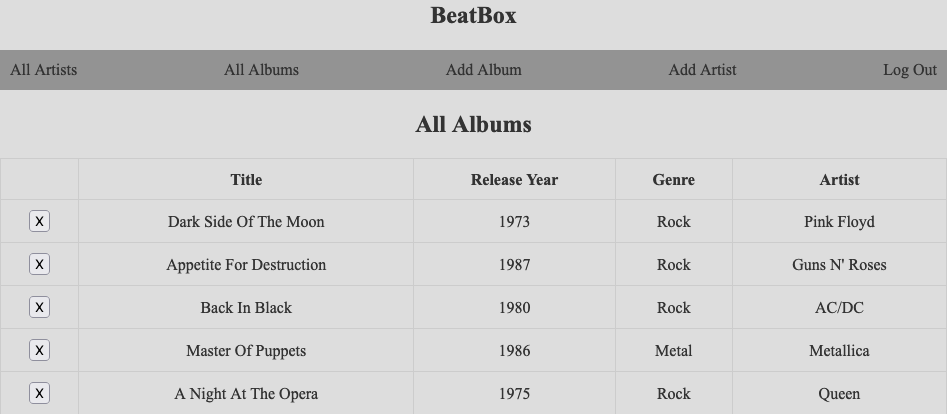
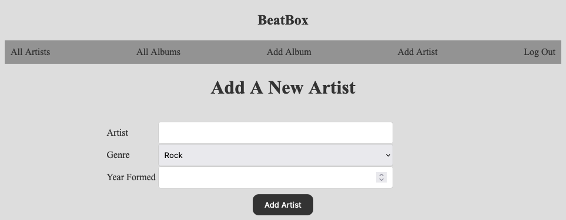
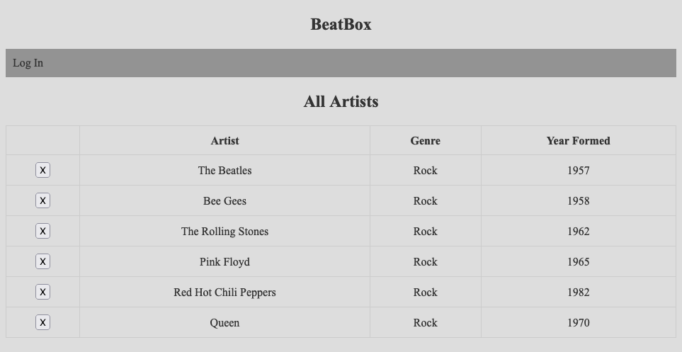

# BeatBox

## Date 5/25/23

---

### By: Savino Lugo

[GitHub](https://github.com/SavinoLugo) | [LinkedIn](https://www.linkedin.com/in/savinolugo/) | [Trello](https://trello.com/u/savinolugo/boards)

---

## **_Description_**

This music catalog will allow you to input your favorite artsist with some information as well as input your favorite albums witht some info about them as well. It's a great way to keep track of the msuic you enjoy.

---

## **_Getting started_**

After signing in the user can navigate between four different pages two of which will display the artist or the album. While the other two allow the user to add an album or artist.

---

## **_Resources_**

[Trello](https://trello.com/b/LkZT1O4J/music-catalog)

[StackOverflow](https://stackoverflow.com/)

[w3schools](https://www.w3schools.com/)
